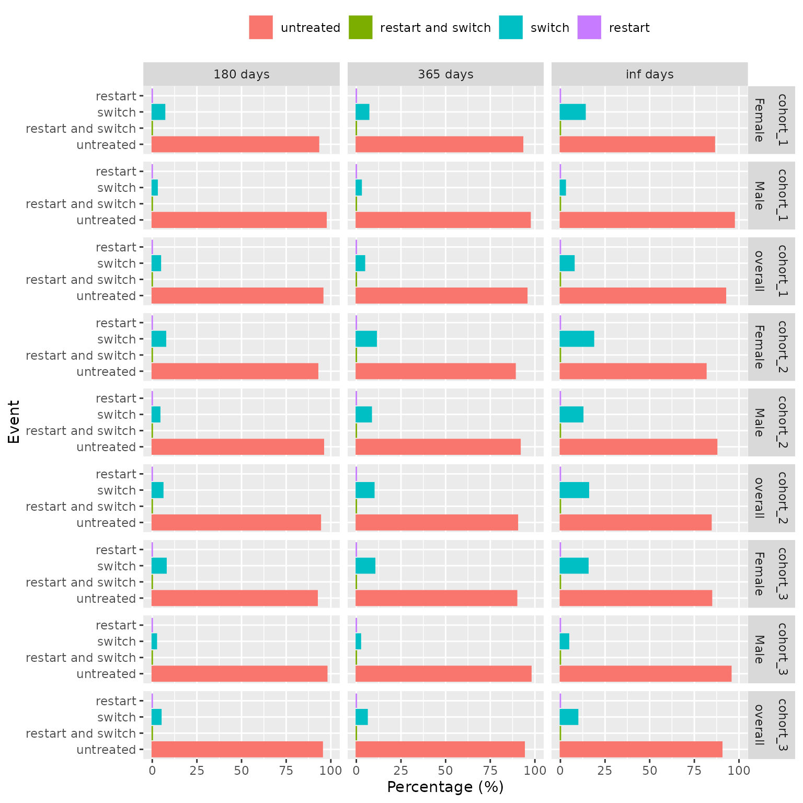

# Assessing drug restart and switching after treatment

## Introduction

Obtaining information on drug restart or switching to another drug after
discontinuation of the original treatment is often of interest in drug
utilisation studies. In this vignette, we show how to assess drug
switching and restart with this package.

## Data

### Connect to mock data

For this vignette we will use mock data contained in the DrugUtilisation
package.

``` r
library(DrugUtilisation)
library(CodelistGenerator)
library(dplyr, warn.conflicts = FALSE)
library(PatientProfiles)

cdm <- mockDrugUtilisation(numberIndividual = 200, source = "duckdb")
```

### Generate study cohorts

We will examine the patterns of drug restart and switching among
patients taking metformin as an example. Specifically, we will
investigate whether patients restart metformin after discontinuation,
switch to insulin, try both medications, or remain untreated.

For this we will need two cohorts: one of patients exposed to metformin
and another of patients exposed to insulin.

``` r
# codelists
metformin <- getDrugIngredientCodes(cdm = cdm, name = "metformin")
insulin <- getDrugIngredientCodes(cdm = cdm, name = "insulin detemir")

cdm <- generateDrugUtilisationCohortSet(
  cdm = cdm, name = "metformin", conceptSet = metformin
)
cdm$metformin |>
  cohortCount()
#> # A tibble: 1 × 3
#>   cohort_definition_id number_records number_subjects
#>                  <int>          <int>           <int>
#> 1                    1            107              92

cdm <- generateDrugUtilisationCohortSet(
  cdm = cdm, name = "insulin", conceptSet = insulin
)
cdm$insulin |>
  cohortCount()
#> # A tibble: 1 × 3
#>   cohort_definition_id number_records number_subjects
#>                  <int>          <int>           <int>
#> 1                    1             93              85
```

## Assess drug restart

The
[`summariseDrugRestart()`](https://darwin-eu.github.io/DrugUtilisation/reference/summariseDrugRestart.md)
function analyses the outcomes within a treatment cohort following the
first exposure to a specific drug. It categorises the events into four
distinct groups:

- Restarting the same treatment.

- Switching to a different treatment.

- Restarting the same treatment while also switching to another.

- Discontinuing treatment altogether (neither the original treatment nor
  any potential switch).

The figure below illustrates the analysis, focusing on the outcomes
after the initial exposure to a particular drug (in blue), with
consideration of a specific switch drug (in orange). This study examines
what occurs within 100, 180, and 365 days following first treatment
discontinuation in the cohort.


Now, let’s use the function to assess metformin restart and switch to
insulin after the first metformin treatment.

``` r
results <- cdm$metformin |>
  summariseDrugRestart(
    switchCohortTable = "insulin",
    switchCohortId = NULL,
    strata = list(),
    followUpDays = Inf,
    censorDate = NULL,
    restrictToFirstDiscontinuation = TRUE
  )

results |>
  glimpse()
#> Rows: 8
#> Columns: 13
#> $ result_id        <int> 1, 1, 1, 1, 1, 1, 1, 1
#> $ cdm_name         <chr> "DUS MOCK", "DUS MOCK", "DUS MOCK", "DUS MOCK", "DUS …
#> $ group_name       <chr> "cohort_name", "cohort_name", "cohort_name", "cohort_…
#> $ group_level      <chr> "6809_metformin", "6809_metformin", "6809_metformin",…
#> $ strata_name      <chr> "overall", "overall", "overall", "overall", "overall"…
#> $ strata_level     <chr> "overall", "overall", "overall", "overall", "overall"…
#> $ variable_name    <chr> "Drug restart till end of observation", "Drug restart…
#> $ variable_level   <chr> "restart", "restart", "switch", "switch", "restart an…
#> $ estimate_name    <chr> "count", "percentage", "count", "percentage", "count"…
#> $ estimate_type    <chr> "integer", "percentage", "integer", "percentage", "in…
#> $ estimate_value   <chr> "13", "14.1304347826087", "3", "3.26086956521739", "2…
#> $ additional_name  <chr> "follow_up_days", "follow_up_days", "follow_up_days",…
#> $ additional_level <chr> "inf days", "inf days", "inf days", "inf days", "inf …
```

We could be interested in getting these results in different follow-up
periods since the first metformin exposure ended. For instance, next we
get the results in the first 180 days, the first year, and until the end
of observation.

``` r
results <- cdm$metformin |>
  summariseDrugRestart(
    switchCohortTable = "insulin",
    switchCohortId = NULL,
    strata = list(),
    followUpDays = c(180, 365, Inf),
    censorDate = NULL,
    restrictToFirstDiscontinuation = TRUE
  )
```

Other options that this function allows are:

- **restrictToFirstDiscontinuation**

By default this argument is set to TRUE, which means that we only
consider the firsts exposure of the subject. If FALSE, the analysis is
conducted on a record level, considering all exposures in the cohort, as
the following image illustrates:


- **censorEndDate**

This argument allows to stop considering restart and switch events after
a certain date, which must specified as a column in the cohort.

- **incident**

This argument is by default TRUE, which means we will only consider
switch treatments starting after discontinuation. If set to FALSE, we
will allow switch treatments starting before the discontinuation of the
treatment and ending afterwards.

- **followUpDays**

The follow-up of the individuals will be set to Inf by default, i.e. we
will follow them up for as long as possible. However, we can restrict
the follow-up period to any other time interval as seen in the previous
example.

- **strata**

This argument must be a list pointing to columns or combinations of
columns in the cohort to use as strata. It will produce stratified
estimates as well as for the overall cohort.

For instance, we reproduce the last calculation but this time straifying
by sex. We first use PatientProfiles to add a column indicating the sex,
which later we use in strata.

``` r
results <- cdm$cohort1 |>
  addSex(name = "cohort1") |>
  summariseDrugRestart(
    switchCohortTable = "insulin",
    switchCohortId = NULL,
    strata = list("sex"),
    followUpDays = c(180, 365, Inf),
    censorDate = NULL,
    restrictToFirstDiscontinuation = TRUE
  )
```

## Visualise drug restart

The package has table and plot functions to help visualising the results
from
[`summariseDrugRestart()`](https://darwin-eu.github.io/DrugUtilisation/reference/summariseDrugRestart.md).

### Table

The function
[`tableDrugRestart()`](https://darwin-eu.github.io/DrugUtilisation/reference/tableDrugRestart.md)
will create a gt, flextable or tibble table from the summarised_result
object created with
[`summariseDrugRestart()`](https://darwin-eu.github.io/DrugUtilisation/reference/summariseDrugRestart.md).
This function offers multiple customisation options to format the
resulting table according to the user preferences.

``` r
results |>
  tableDrugRestart()
#> cdm_name, cohort_name, variable_name, follow_up_days, censor_date,
#> cohort_table_name, incident, restrict_to_first_discontinuation, and
#> switch_cohort_table are missing in `columnOrder`, will be added last.
```

[TABLE]

### Plot

The
[`plotDrugRestart()`](https://darwin-eu.github.io/DrugUtilisation/reference/plotDrugRestart.md)
function creates a bar plot depicting the percentage of drug restart
events for each cohort, stratum, and follow-up time (specified in the
variable_name column of the summarised result). This function offers
customisation options for colours, facetting, and handling of strata.

``` r
results |>
  plotDrugRestart(facet = cohort_name + sex ~ follow_up_days)
```



### Adding the information to an existing cohort

We can directly add the drug restart information to an existing cohort
as a column instead of asking for a summarising object. In this case we
will use the function
[`addDrugRestart()`](https://darwin-eu.github.io/DrugUtilisation/reference/addDrugRestart.md),
which will add one column per follow-up window we ask for:

``` r
cdm$metformin |>
  addDrugRestart(
    switchCohortTable = "insulin",
    switchCohortId = NULL,
    followUpDays = c(180, 365, Inf),
    censorDate = NULL
  )
#> # Source:   table<og_038_1763592698> [?? x 7]
#> # Database: DuckDB 1.4.2 [unknown@Linux 6.11.0-1018-azure:R 4.5.2/:memory:]
#>    cohort_definition_id subject_id cohort_start_date cohort_end_date
#>                   <int>      <int> <date>            <date>         
#>  1                    1        116 2016-12-01        2017-06-29     
#>  2                    1         59 2019-09-08        2020-06-19     
#>  3                    1        103 2010-11-18        2014-07-23     
#>  4                    1        129 2020-01-10        2020-08-31     
#>  5                    1         98 2014-07-10        2016-02-06     
#>  6                    1         19 2009-03-10        2011-04-27     
#>  7                    1        121 2019-05-17        2019-11-13     
#>  8                    1        128 2021-08-20        2021-08-20     
#>  9                    1          4 2009-05-01        2009-11-27     
#> 10                    1        191 2019-11-02        2020-04-17     
#> # ℹ more rows
#> # ℹ 3 more variables: drug_restart_180 <chr>, drug_restart_365 <chr>,
#> #   drug_restart_inf <chr>
```
